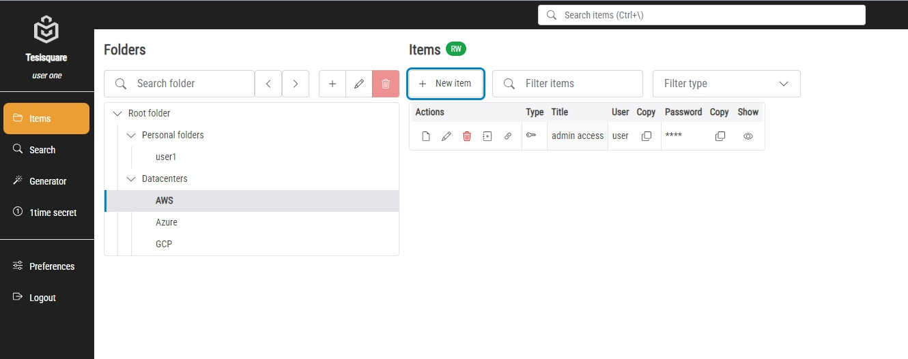
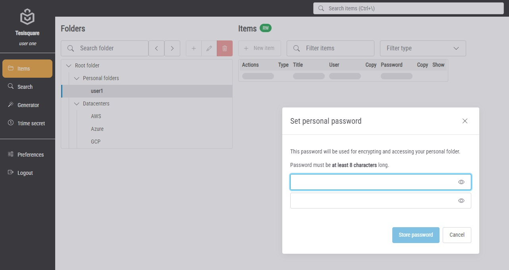
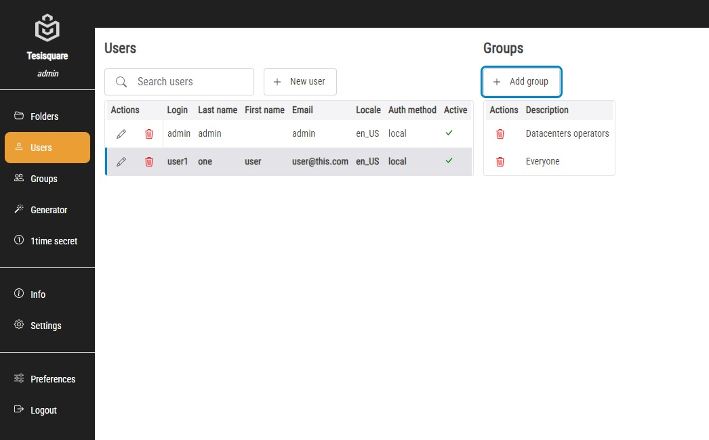

# About

PassWeaver-GUI is standalone WEB interface to PassWeaver-API, bringing collaborative enterprise-scale password management to your browser. It's developed using mainly NodeJS, Express and EJS, and uses Shoelace for WEB Components.

PassWeaver-GUI is an opensource project, released under MIT license.

# Features

- Personal folders for each user
- Share one-time secrets to anyone
- Share items through permalinks
- Share one time secrets
- Folder level permissions
- User groups
- Both LDAP and local authentication
- CSP compliant pages
- Quick user interface
- Light or dark theme

# Forewords

PassWeaver-GUI is a nice frontend to PassWeaver-API and it brings all its capabilities to the final user; everything you can do with your items, folders, users and groups is defined in PassWeaver-API. See docs there for more info about its capabilities.

While PassWeaver-API is a generic and independent piece of background software, PassWeaver-GUI is its perfect UI companion.

# Basics

With PassWeaver-GUI you will manage these entities:

- Items, holding your secret data
- Users
- Groups
- Folders

In a few words:
- items are stored in folders, and folders can contain both items and other folders. - users join groups (one or more), and...
- groups can read or write on a given folder, its items and subfolders.

## Items

This is what the items page looks like:

In "Folders" left pane you can create a subfolder, modify or delete a folder, if you have permission on it. You can also search for a folder and use the previous/next buttons to navigate the tree.

In "Items" right pane you have a list of folder item, with the following actions, if you have proper permissions:
- View item
- Edit item
- Delete item
- Clone item
- Copy link

You have also buttons for coping the passwords (without the need of showing it) or showing it, without the need of opening the dialog dialog.

This is the item details dialog.

When creating a new item, only the "Title" field is mandatory, all the remaining fields are optional.

### Personal folders

Each user has a personal folder named after its login. Only the user can unlock this folder because it's protected with an additional password that is set the first time the user clicks on the folder:

Note that this password is used to further encrypt user's personal items, so if it get lost **it will not be possible** to decrypt them anymore!

The password will be asked again at every new login:

Once unlocked, the personal folder will work as any other folder.

## Search

You can search items by using the left pane menu or by clicking `Ctrl+\` as a shortcut (start typing something and press `Enter`).

You can search items with a matching title, username or folder name (parents included) within all the folders you have access to. Items can be filtered by type too.

## Generator

This page lets you generate a random secure password. You can copy it or generate another one by clicking on the wand button.

## One time secret

With one-time-secret you can share a secret information also outside your organization by creating a public link that will be visible only once.

Type the secret and then press the "Create link" button:

You can then share the link with your peer, who does not need to have an account on your organization: the link is public and will be usable only once.

By clicking the "Show secret" button, the secret will be displayed, and the link will be "burnt":

# Preferences

In the "Preferences" page, you can:

- Choose your theme (light or dark)
- Change your login password (if Authentication is `LDAP`, see [Users](#Users) )
- Change your personal folder password

# Admin pages

Administrators have a different set of pages: they do NOT have access to item, but they have the possibility to manage users and groups, and assign/revoke permissions to folders.

## Folders

In this page you can assign/remove groups to a given folder, and you can toggle the permissions by clicking on the shield icon.

Inherited permissions from parent folders cannot be modified.

## Users

From this page you can add or delete users, and assign/remove the groups membership.

When creating a user you're prompted this dialog:

- Login: mandatory
- Email: mandatory
- Last name: mandatory
- First name
- Locale: at the moment only en_US is supported; mandatory
- Authentication method: `local` or `LDAP`; mandatory
- Password and confirm password: only used in `local` authentication, they are nevertheless mandatory even if you use `LDAP` auth.

## Groups

From here you can create or delete groups, and add/remove members. You can nest groups, but membership is NOT inherited: the user is only member of explicitly assigned groups.

## Info

This page gives you some information about API and GUI status

## Settings

From this page you can manage the item types:

Note that when you delete and item types, every item that used that type will be reset to 'null'.

In the "Cache" pane, you can reset the API cache causing it to reload users permissions and visible folders.

This operation is needed only after directly operating on the API database... which is not advisable anyway.