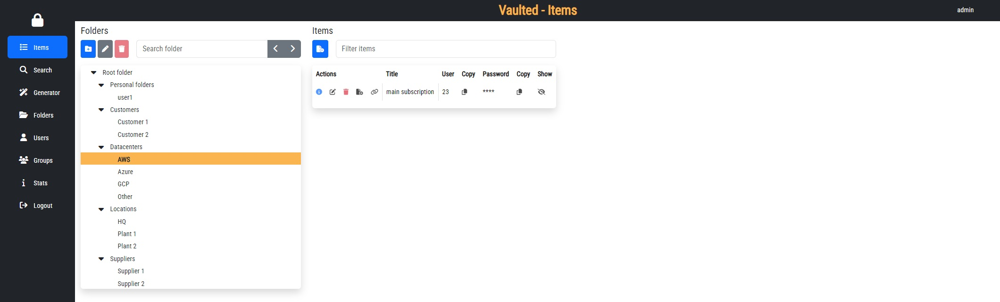
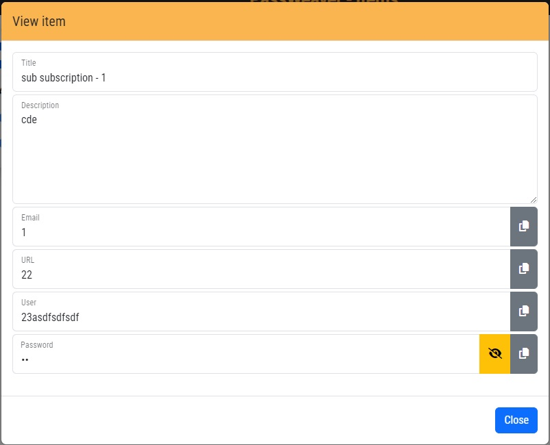
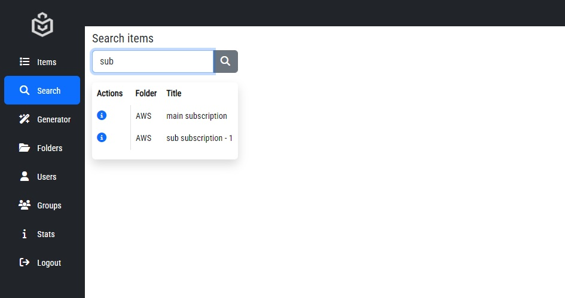
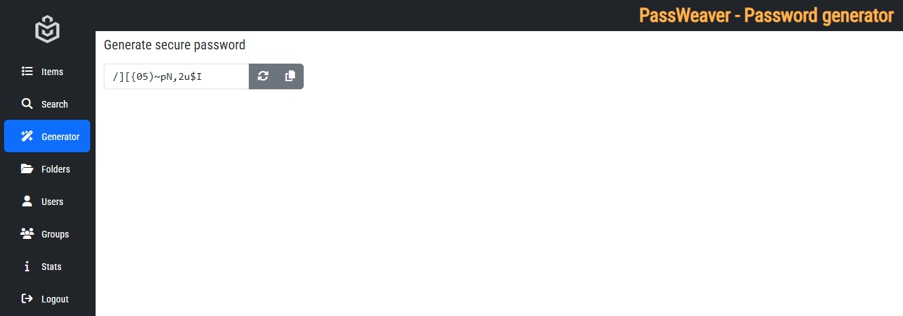
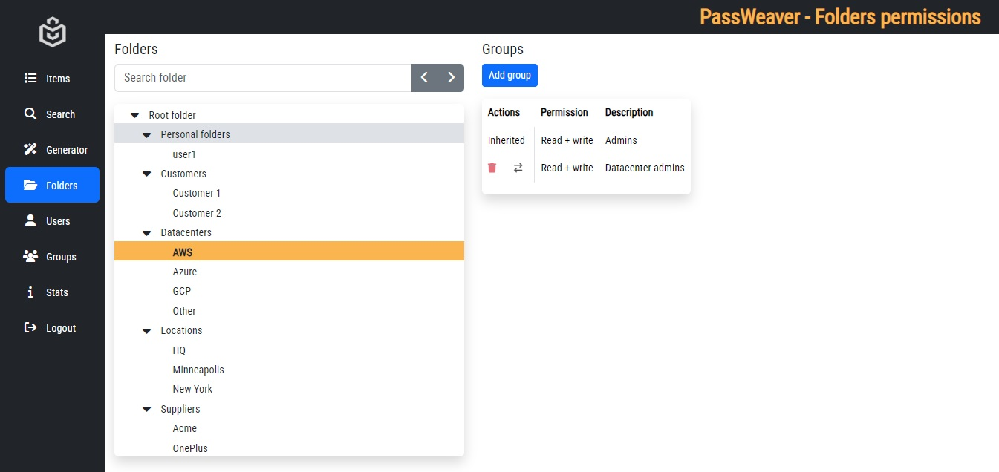
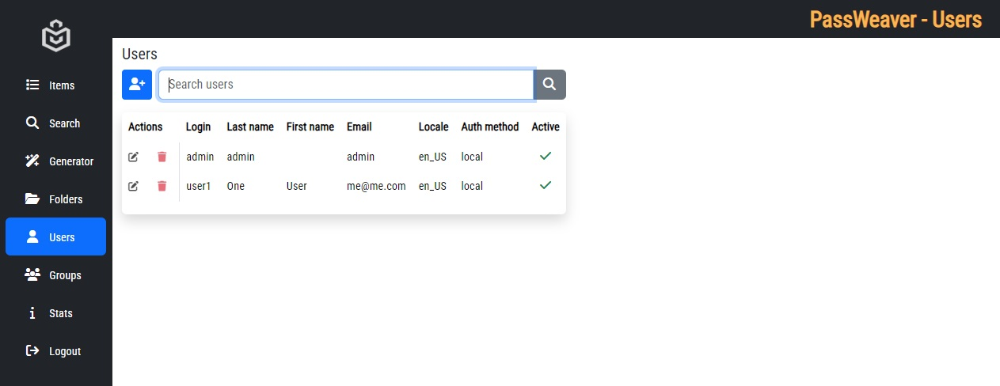
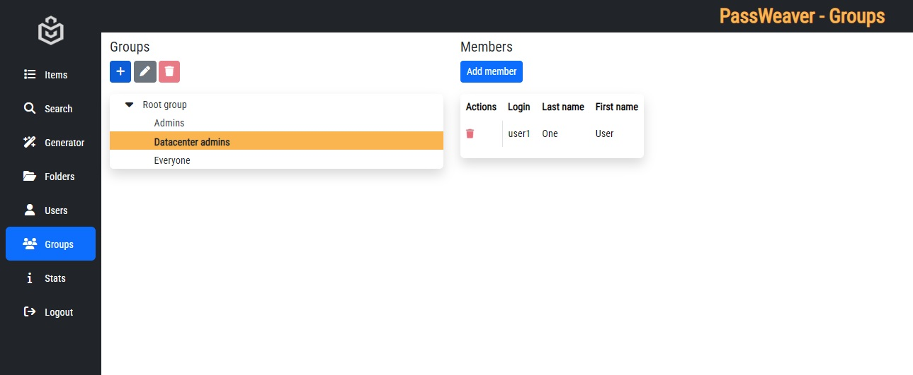

# About

PassWeaver-GUI is standalone WEB interface to PassWeaver-API, bringing collaborative enterprise-scale password management to your browser. It's developed using mainly NodeJS, Express and EJS, and uses Shoelace for WEB Components.

PassWeaver-GUI is an opensource project, released under MIT license.

# Features

- Personal folders for each user
- Share one-time secrets to anyone
- Share items through permalinks
- Share one time secrets
- Folder level permissions
- User groups
- Both LDAP and local authentication
- CSP compliant pages
- Quick user interface
- Light or dark theme

# Forewords

PassWeaver-GUI is a nice frontend to PassWeaver-API and it brings all its capabilities to the final user; everything you can do with your items, folders, users and groups is defined in PassWeaver-API. See docs there for more info about its capabilities.

While PassWeaver-API is a generic and independent piece of background software, PassWeaver-GUI is its perfect UI companion.

# Basics

With PassWeaver-GUI you will manage these entities:

- Users
- Groups
- Folders
- Items, holding your secret data

Items are stored in folders, and folders can contain both items and other folders. Users join groups (one or more), and groups can read or write on a given folder, its items and subfolders.

## Items

This is what the items page looks like:

In "Folders" left pane you can create a subfolder, modify or delete a folder, if you have permission on it. You can also search for a folder and use the previous/next buttons to navigate the tree.

In "Items" right pane you have a list of folder item, with the following actions, if you have proper permission:
- View item
- Edit item
- Delete item
- Clone item
- Copy link

You can also copy to clipboard both the username and the password. With the "Show" icon, you can toggle view/hide password for that single item.

This is the item details dialog:

## Search

In the "Search" page you can search items with a matching title or username within all the folders you have access to. Just type a string to search for.

## Generator

## One time secret

## Folders

## Users

## Groups

## Info

