# About

PassWeaver-GUI is a WEB interface to PassWeaver-API, bringing you a portable, collaborative and enterprise-scale password management system.

PassWeaver-GUI is an opensource project, released under MIT license. See [Technical info](#Technical-specs) for some details.

# Features

- Personal folders for each user
- Share one-time secrets with anyone, even if they have not an account
- Share items through permalinks
- Folder level permissions
- User groups
- Both LDAP and local authentication
- CSP compliant pages
- Quick and clean user interface
- Light or dark theme

# Forewords

PassWeaver-GUI is a complete frontend to PassWeaver-API; everything you can do with your items, folders, users and groups is defined in PassWeaver-API. See docs at [this link](https://steunix.github.io/passweaver-api/) for a detailed description of what PassWeaver-API is.

While PassWeaver-API is a generic and independent backend API, PassWeaver-GUI is its perfect UI companion.

# Basics

With PassWeaver-GUI you will manage these entities:

- Items, holding your secret data
- Items type
- Users
- Groups
- Folders
- One time secrets

In a few words:
- items are stored in folders, and folders can contain both items and other folders.
- users join groups (one or more), and...
- groups can read or write a given folder, its items and subfolders.

## Login

Access the site using your credentials

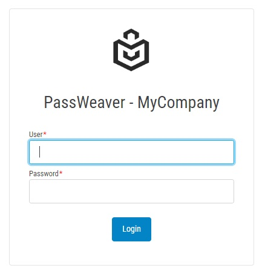

## Items

This is what the items page looks like:

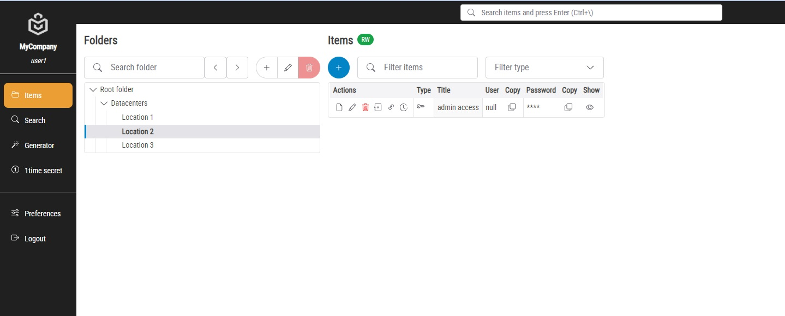

In "Folders" left pane you can create a subfolder, modify or delete a folder, if you have write permissions. You can also search for a folder and use the previous/next buttons to navigate the tree.

In "Items" right pane you have a list of folder items with the following actions:
- View item
- Edit item
- Delete item
- Clone item
- Copy link
- View history

You have also buttons for showing or coping the passwords without the need of showing them.

You can create items using the blue "plus" button.

Some actions may be unavailable if you don't have write permissions on the folder.

By double clicking the item title, or by clicking on details or edit buttons, the following popup is shown.

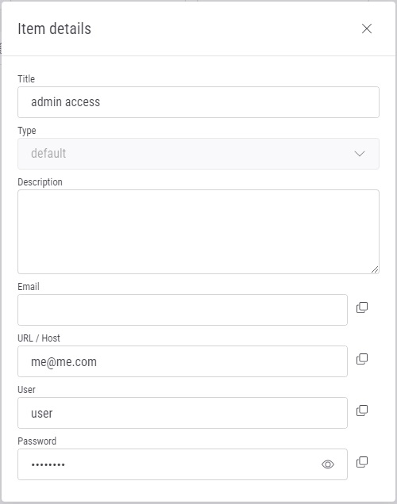

When creating a new item, only the "Title" field is mandatory, all the remaining fields are optional.

### Personal folders

Each user has a personal folder named after its login. Only the user can unlock this folder because it's protected with an additional password that is set the first time the user clicks on the folder:

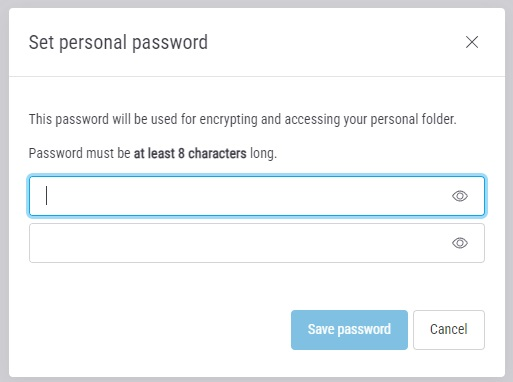

Note that this password is used to further encrypt user's personal items, so if it get lost **it will not be possible** to decrypt them anymore!

The password will be asked again at every new login:

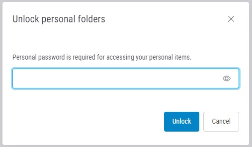

Once unlocked, the personal folder will work as any other folder.

## Search

You can search items by using the left pane menu or by clicking `Ctrl+\` as a shortcut (start typing something and press `Enter`).

You can search items with a matching title, username or folder name (parents included) within all the folders you have access to. Items can be filtered by type too.

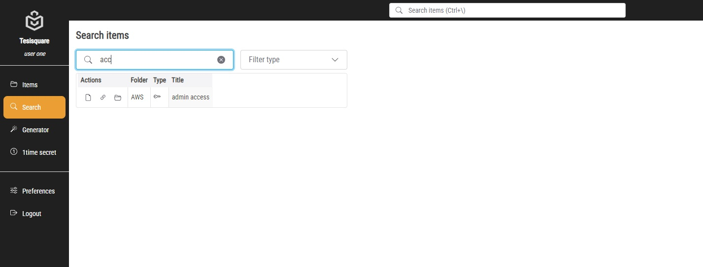

## Generator

This page lets you generate a random secure password. You can copy it or generate another one by clicking on the wand button.

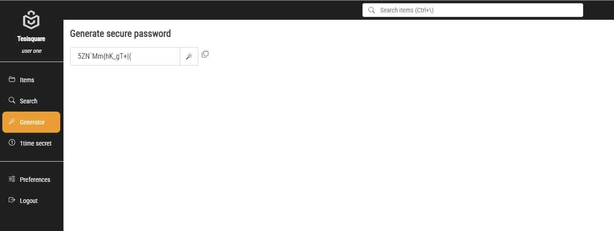

## One time secret

With one-time-secret you can share a secret information even outside your organization by creating a public link that will be visible only once.

Type the secret and then press the "Create link" button:

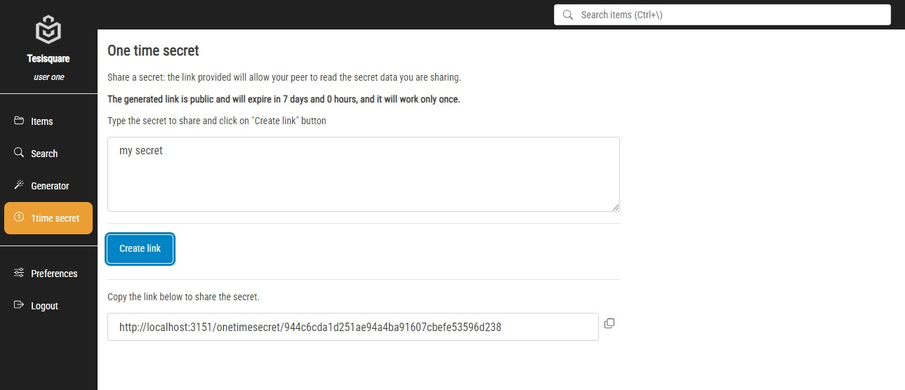

You can then share the link with your peer, who does not need to have an account on your organization: the link is public and will be usable only once.

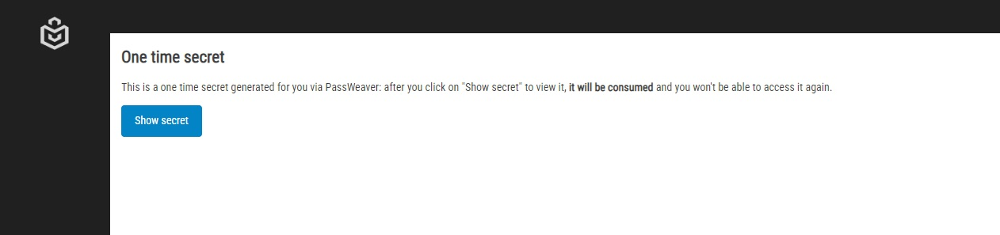

By clicking the "Show secret" button, the secret will be displayed, and the link will be "burnt":

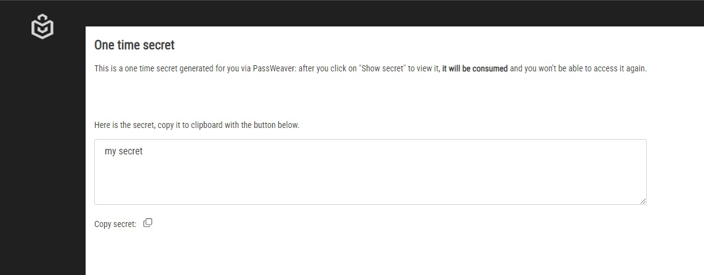

# Preferences

In the "Preferences" page, you can:

- Choose your theme (light or dark)
- Change your login password (if Authentication is `local`, see [Users](#Users) )
- Change your personal folder password

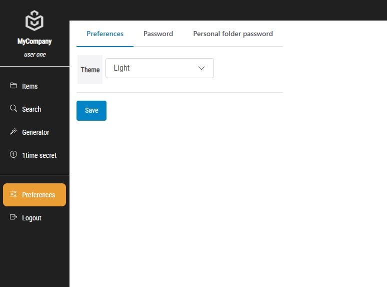

# Admin pages

Administrators have a different set of pages: they do NOT have access to any item, but they have the possibility to create, rename or delete folders (if empty), manage users and groups, and assign/revoke permissions on folders to groups.

## Folders

In this page you can assign/remove groups to a given folder, and you can toggle the permissions by clicking on the shield icon.

Inherited permissions from parent folders cannot be modified.

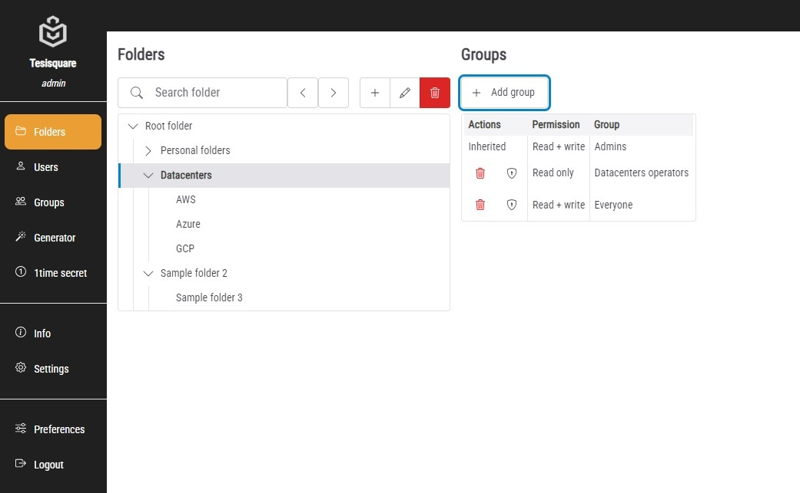

Admins can create or rename folders and also delete folders, if empty.

## Users

From this page you can add or delete users, and assign/remove the groups membership.

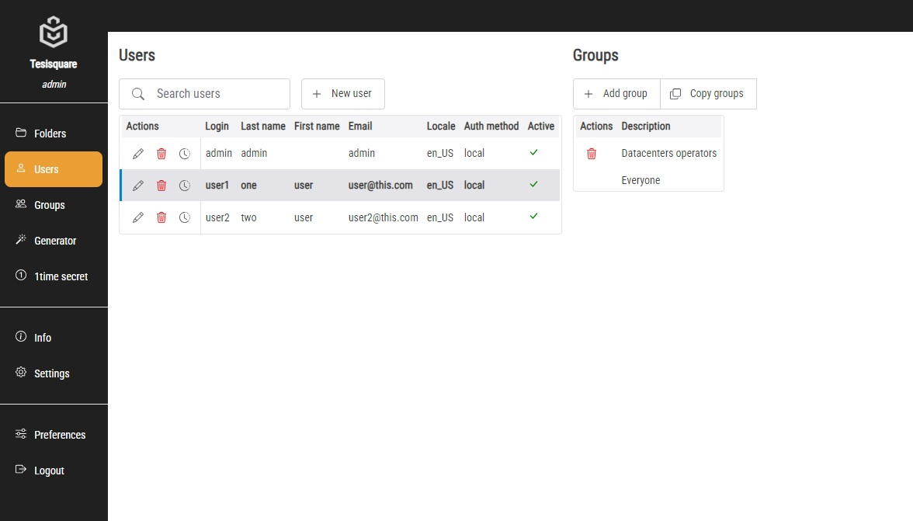

By clicking the history button (the clock icon) in user list you can access a history of user's activity:

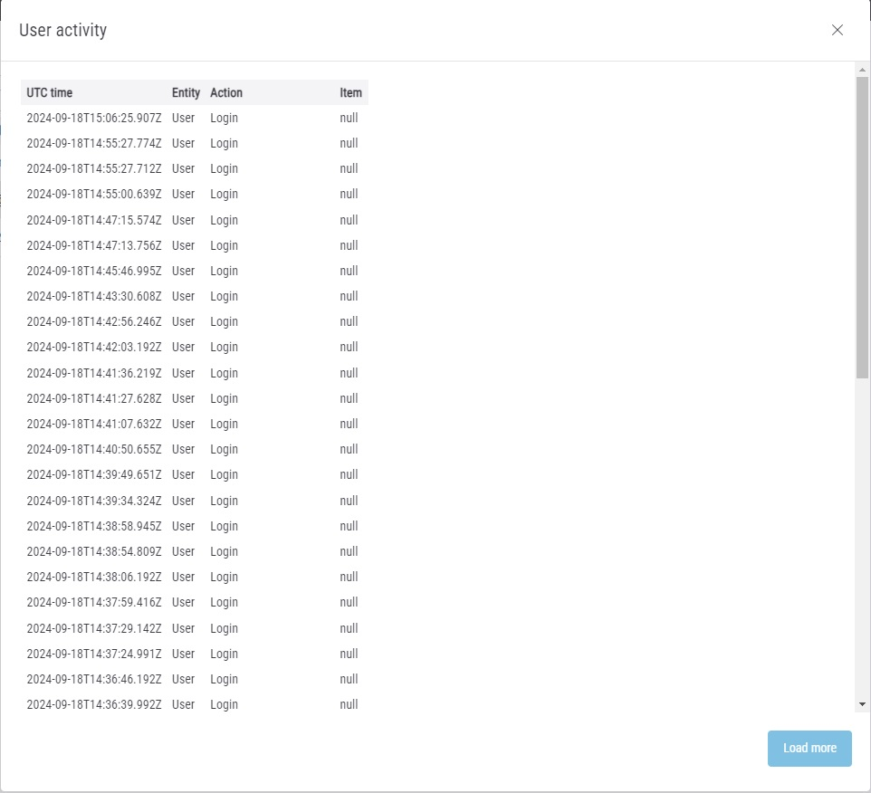

Only more recent events are shown, click on "Load more" button in order to load more activity.

You can copy the current users groups in order to assign them to another user:
- Select a user from the list
- Click "Copy groups" button
- Select the target user
- Click:
  - Paste groups: add the copied groups to the target users
  - Replace groups: replace target user's groups with the copied ones

When creating a new user you're prompted with this dialog:

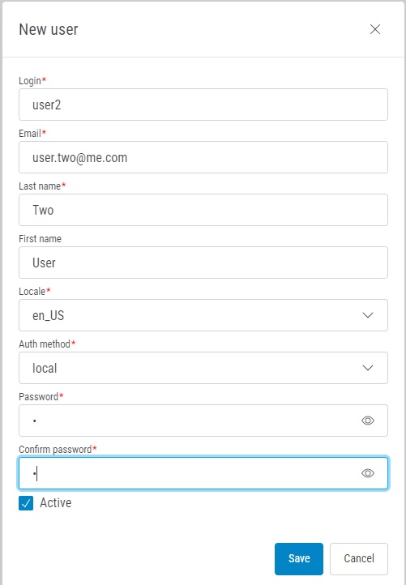

- Login: mandatory
- Email: mandatory
- Last name: mandatory
- First name
- Locale: at the moment only en_US is supported; mandatory
- Authentication method: `local` or `LDAP`; mandatory
- Password and confirm password: only used in `local` authentication, they are nevertheless mandatory even if you use `LDAP` auth.

## Groups

From this page you can create or delete groups, and add/remove members. You can nest groups, but membership is NOT inherited: the user is only member of explicitly assigned groups.

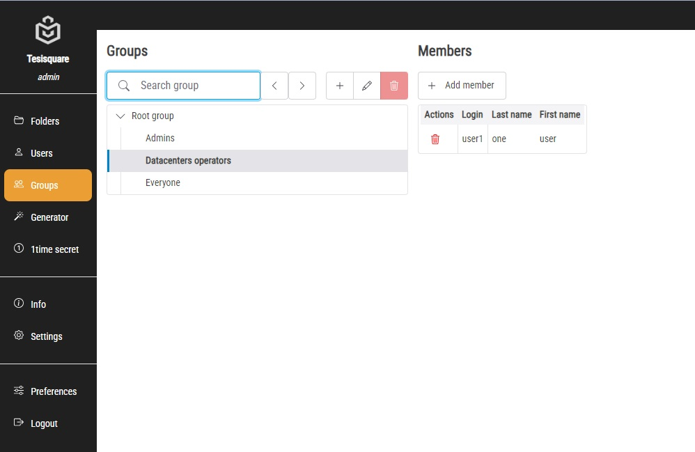

## Info

This page gives you some information about API and GUI status

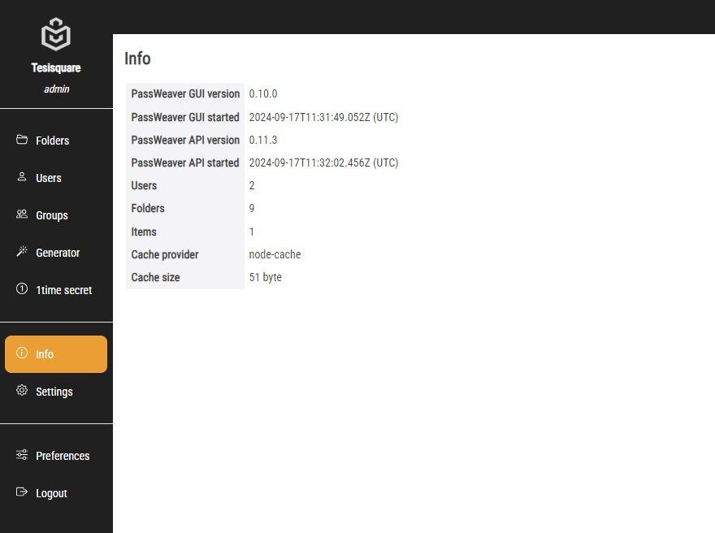

## Settings

From this page you can manage the item types:

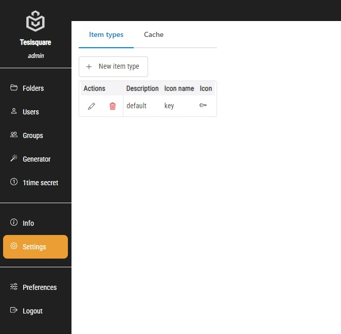

Note that when you delete and item types, every item that used that type will be reset to 'null'.

In the "Cache" pane, you can reset the API cache causing it to reload users permissions and visible folders.

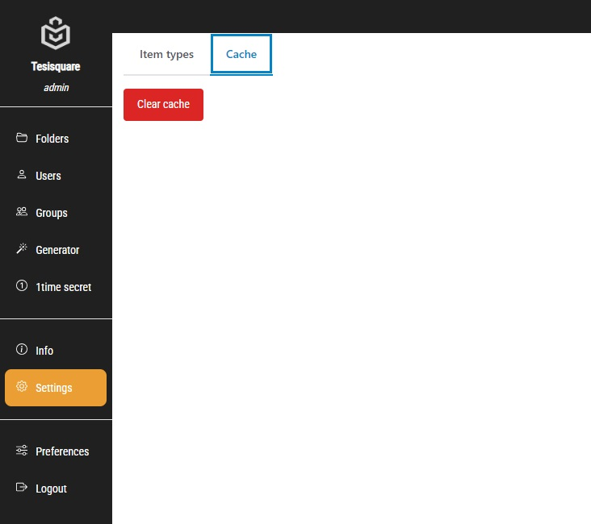

This operation is needed only after directly operating on the API database... which is not advisable anyway.

# Install and run

## Prerequisites

In order to be able to install PassWeaver API, you need:
  - NodeJS and npm
  - A running PassWeaver-API

A running Redis instance is warmly advised.

## Install

Download the source, and install all dependencies with npm:

`npm install`

## Configure

Copy `config-skel.json` to `config.json` and adjust the options:

- `listen`:
  - `port`: port to bind
  - `host`: IP address to bind (or blank for any address)
- `passweaverapi_url`: URL for PassWeaver-API (/api/v1 included)
- `company_name`: Company name
- `static_maxage_sec`: Static assets (JS/CSS) cache max-age (in seconds)
- `log`:
  - `dir`: Logs directory. It will be created if necessary.
  - `rotation`: Rotation interval. For example, "12h" or "1d"
  - `retention`: Log files retention (number of rotated log files kept)
- `https`:
  - `enabled`: HTTPS enabled (true/false)
  - `certificate`: certificate file path
  - `private_key`: certificate private key
  - `hsts`: enable HSTS (true/false)
- `onetimetokens`:
  - `default_hours`: Default one-time tockens duration in hours
- `redis`:
  - `enabled`: true or false; if false, internal cache is uses
  - `url`: Redis url
- `folders`:
  - `user_managed`: if yes, non-admin can create and delete folders

# Technical specs

Passweaver-GUI is developed in NodeJS and uses these great libs (among others):
- `ExpressJS` (version 5, but 4.x is fine too)
- `EJS` for HTML templating
- `Shoelace` WEB components
- `Morgan` for logging
- `Helmet` and `Lusca` for CSFR and CSP compliance
- `Got` for interacting with Passweaver-API